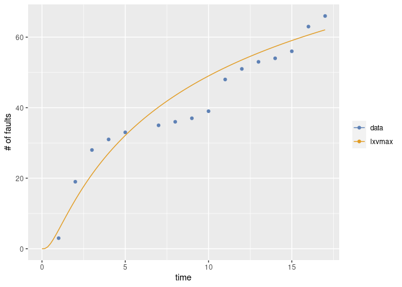
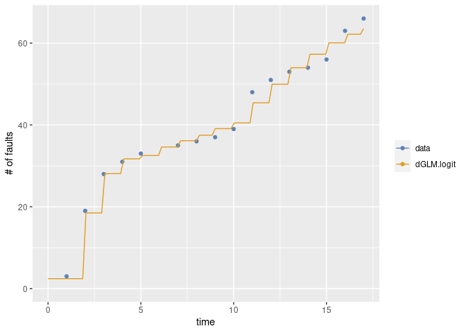
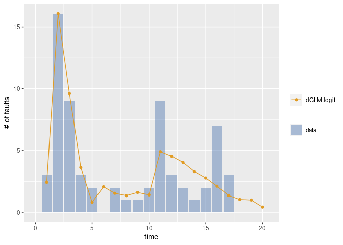
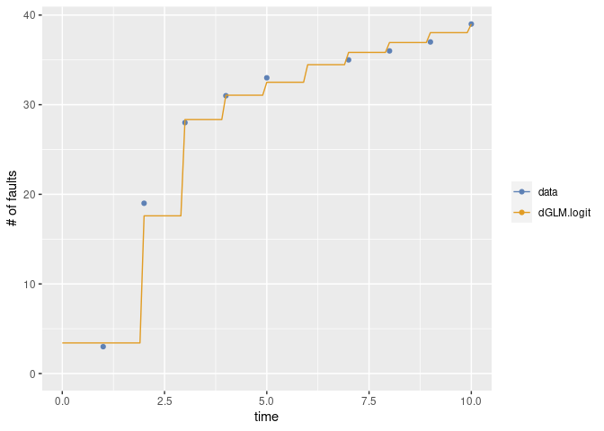
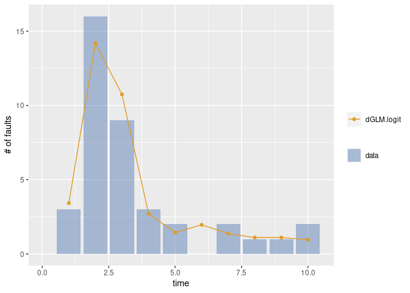

msrat_example2
================

## msrat利用例

msratでは以下の二種類のメトリクスが利用できます．

-   d-metrics: dynamic
    メトリクス．テスト期間で変化するもの．例えば，その日のテストケース数や検証した機能数など
-   s-metrics: static
    メトリクス．テスト期間を通じて基本的に変化しないもの．開発規模など

ここでは d-metrics の利用例を示します．

### データ

-   次のデータを利用
    -   fault: 発見バグ数
    -   tc: テストケース数
    -   ctc: その累積
    -   cov: コードカバレジの増分
    -   ccov: コードカバレッジ

``` r
library(msrat)
```

    ## Loading required package: Rsrat

    ## Warning: The packages `ellipsis` (>= 0.3.2) and `vctrs` (>= 0.3.8) are required
    ## as of rlang 1.0.0.

    ## Warning: replacing previous import 'lifecycle::last_warnings' by
    ## 'rlang::last_warnings' when loading 'tibble'

    ## Warning: replacing previous import 'ellipsis::check_dots_unnamed' by
    ## 'rlang::check_dots_unnamed' when loading 'tibble'

    ## Warning: replacing previous import 'ellipsis::check_dots_used' by
    ## 'rlang::check_dots_used' when loading 'tibble'

    ## Warning: replacing previous import 'ellipsis::check_dots_empty' by
    ## 'rlang::check_dots_empty' when loading 'tibble'

    ## Warning: replacing previous import 'lifecycle::last_warnings' by
    ## 'rlang::last_warnings' when loading 'pillar'

    ## Warning: replacing previous import 'ellipsis::check_dots_unnamed' by
    ## 'rlang::check_dots_unnamed' when loading 'pillar'

    ## Warning: replacing previous import 'ellipsis::check_dots_used' by
    ## 'rlang::check_dots_used' when loading 'pillar'

    ## Warning: replacing previous import 'ellipsis::check_dots_empty' by
    ## 'rlang::check_dots_empty' when loading 'pillar'

``` r
data(dmet)
dmet.ds1
```

    ##    day fault  tc ctc   cov  ccov
    ## 1    1     3   5   5 0.018 0.018
    ## 2    2    16 175 180 0.409 0.427
    ## 3    3     9 186 366 0.066 0.493
    ## 4    4     3  67 433 0.132 0.625
    ## 5    5     2  14 447 0.013 0.638
    ## 6    6     0  54 501 0.055 0.693
    ## 7    7     2  28 529 0.021 0.714
    ## 8    8     1  15 544 0.018 0.732
    ## 9    9     1  23 567 0.024 0.756
    ## 10  10     2  17 584 0.026 0.782
    ## 11  11     9  74 658 0.051 0.833
    ## 12  12     3  43 701 0.011 0.844
    ## 13  13     2  20 721 0.002 0.846
    ## 14  14     1  12 733 0.013 0.859
    ## 15  15     2  18 751 0.018 0.877
    ## 16  16     7  19 770 0.018 0.895
    ## 17  17     3   9 779 0.000 0.895
    ## 18  18     0   9 788 0.003 0.898
    ## 19  19     0  32 820 0.014 0.912
    ## 20  20     0   8 828 0.000 0.912

### 通常の評価

``` r
m <- fit.srm.nhpp(fault=dmet.ds1$fault)
```

    ## Warning in emfit(srm, data, initialize = TRUE, maxiter = con$maxiter, reltol =
    ## con$reltol, : Did not converge to MLE by max iteration.

    ## Warning in emfit(srm, data, initialize = TRUE, maxiter = con$maxiter, reltol =
    ## con$reltol, : Did not converge to MLE by max iteration.

``` r
mvfplot(fault=dmet.ds1$fault, mvf=list(m$srm))
```

<!-- -->

``` r
m$srm$omega() - m$srm$data$total # 残存バグ数
```

    ##    omega 
    ## 68.16032

### カバレッジを考慮した評価

``` r
m2 <- fit.srm.logit(formula=fault~tc+ctc+cov+ccov, data=dmet.ds1)
m2 <- step(m2) # 変数選択
```

    ## Start:  AIC=86.31
    ## fault ~ tc + ctc + cov + ccov

    ## Warning in Rsrat::emfit(model, ldata, initialize = TRUE, maxiter =
    ## con$maxiter, : Did not converge to MLE by max iteration.

    ##        Df    AIC
    ## <none>    86.312
    ## - tc    1 89.756
    ## - ccov  1 91.844
    ## - ctc   1 92.054
    ## - cov   1 93.303

``` r
mvfplot(fault=dmet.ds1$fault, mvf=list(m2$srm))
```

<!-- -->

``` r
dmvfplot(fault=dmet.ds1$fault, dmvf=list(m2$srm))
```

<!-- -->

``` r
m2$srm$omega() - m2$srm$data$total # 残存バグ数
```

    ##     omega 
    ## 0.3937302

### カバレッジを考慮した評価（10日分）

``` r
m3 <- fit.srm.logit(formula=fault~tc+ctc+cov+ccov, data=dmet.ds1[1:10,])
```

    ## Warning in Rsrat::emfit(model, ldata, initialize = TRUE, maxiter =
    ## con$maxiter, : Did not converge to MLE by max iteration.

``` r
m3 <- step(m3) # 変数選択
```

    ## Start:  AIC=43.48
    ## fault ~ tc + ctc + cov + ccov

    ## Warning in Rsrat::emfit(model, ldata, initialize = TRUE, maxiter =
    ## con$maxiter, : Did not converge to MLE by max iteration.

    ## Warning in Rsrat::emfit(model, ldata, initialize = TRUE, maxiter =
    ## con$maxiter, : Did not converge to MLE by max iteration.

    ## Warning in Rsrat::emfit(model, ldata, initialize = TRUE, maxiter =
    ## con$maxiter, : Did not converge to MLE by max iteration.

    ##        Df    AIC
    ## - cov   1 41.482
    ## - ccov  1 41.496
    ## - ctc   1 41.516
    ## <none>    43.482
    ## - tc    1 44.764

    ## Warning in Rsrat::emfit(model, ldata, initialize = TRUE, maxiter =
    ## con$maxiter, : Did not converge to MLE by max iteration.

    ## 
    ## Step:  AIC=41.48
    ## fault ~ tc + ctc + ccov

    ## Warning in Rsrat::emfit(model, ldata, initialize = TRUE, maxiter =
    ## con$maxiter, : Did not converge to MLE by max iteration.

    ##        Df    AIC
    ## - ccov  1 40.086
    ## - ctc   1 40.305
    ## <none>    41.482
    ## - tc    1 47.259

    ## Warning in Rsrat::emfit(model, ldata, initialize = TRUE, maxiter =
    ## con$maxiter, : Did not converge to MLE by max iteration.

    ## 
    ## Step:  AIC=40.09
    ## fault ~ tc + ctc
    ## 
    ##        Df    AIC
    ## - ctc   1 38.350
    ## <none>    40.086
    ## - tc    1 53.789
    ## 
    ## Step:  AIC=38.35
    ## fault ~ tc
    ## 
    ##        Df    AIC
    ## <none>    38.350
    ## - tc    1 53.337

``` r
mvfplot(fault=dmet.ds1$fault[1:10], mvf=list(m3$srm))
```

<!-- -->

``` r
dmvfplot(fault=dmet.ds1$fault[1:10], dmvf=list(m3$srm))
```

<!-- -->

``` r
m3$srm$omega() - m3$srm$data$total # 残存バグ数
```

    ##    omega 
    ## 11.69044
