msrat\_example
================

## msrat利用例

msratでは以下の二種類のメトリクスが利用できます．

  - d-metrics: dynamic メトリクス．テスト期間で変化するもの．例えば，その日のテストケース数や検証した機能数など
  - s-metrics: static メトリクス．テスト期間を通じて基本的に変化しないもの．開発規模など

ここでは s-metrics の利用例を示します． 過去の類似プロジェクトデータを利用し，現在のプロジェクトを評価する．

### Step 1: データ収集

  - 次のデータを収集
      - 総コード行数
      - バグ個数データ：日数とその時に見つかったバグ数

### Step 2: msratのインストールとロード

  - Rstudioでdevtoolsをインストール

<!-- end list -->

``` r
install.packages(pkgs="devtools")
```

  - msratのインストール

WindowsではRtoolsが必要になると思います

``` r
library(devtools)
devtools::install_github("SwReliab/msrat")
```

``` r
library(msrat)
```

    ## Loading required package: Rsrat

### Step 3: データの整形

s-metrics（ここの例では現在の開発プロジェクト`project1`と過去の二つの開発プロジェクト`project2`,`project3`のコード行数）を次のようなCSVにまとめる．

以下は実際のデータではなく例のために作成した人工的なデータです．

`smetrics.csv`

|          | KLOC |
| :------- | ---: |
| project1 |   55 |
| project2 |  185 |
| project3 |  235 |

  - ポイント
      - 列見出しをつけておく
      - 各行に各プロジェクトデータをいれる
      - 各行の先頭列はプロジェクト名（英字でスペースなしにしておくと後々便利）

次に各プロジェクトのバグデータを次のようなCSVにまとめる

`project1.csv`

  - １稼働日毎のバグ数

| days | bugs |
| ---: | ---: |
|    1 |    3 |
|    1 |    0 |
|    1 |    2 |
|    1 |    0 |
|    1 |    1 |
|    1 |    0 |

`project2.csv`

  - １稼働日毎のバグ数

| days | bugs |
| ---: | ---: |
|    1 |    3 |
|    1 |    5 |
|    1 |   10 |
|    1 |    2 |
|    1 |    1 |
|    1 |    0 |
|    1 |    0 |
|    1 |    1 |
|    1 |    0 |
|    1 |    0 |

`project3.csv`

  - 週毎（５稼働日毎）のバグ数
  - 最後のデータだけ３稼働日のバグ数

| days | bugs |
| ---: | ---: |
|    5 |   15 |
|    5 |    8 |
|    5 |    0 |
|    5 |    0 |
|    5 |    1 |
|    5 |    0 |
|    3 |    0 |

  - ポイント
      - 時間軸は全てのデータで同じにする（上記の例では稼働日）
      - バグが0の日もデータに入れる
      - 各プロジェクトデータの列名を同じにしておくと楽

### msrat用のデータ（data.frame）を作る

``` r
metrics <- read.csv(file="smetrics.csv", row.names=1)
bugs <- list(
  project1=read.csv(file="project1.csv"),
  project2=read.csv(file="project2.csv"),
  project3=read.csv(file="project3.csv")
)
metrics
```

    ##          KLOC
    ## project1   55
    ## project2  185
    ## project3  235

``` r
bugs
```

    ## $project1
    ##   days bugs
    ## 1    1    3
    ## 2    1    0
    ## 3    1    2
    ## 4    1    0
    ## 5    1    1
    ## 6    1    0
    ## 
    ## $project2
    ##    days bugs
    ## 1     1    3
    ## 2     1    5
    ## 3     1   10
    ## 4     1    2
    ## 5     1    1
    ## 6     1    0
    ## 7     1    0
    ## 8     1    1
    ## 9     1    0
    ## 10    1    0
    ## 
    ## $project3
    ##   days bugs
    ## 1    5   15
    ## 2    5    8
    ## 3    5    0
    ## 4    5    0
    ## 5    5    1
    ## 6    5    0
    ## 7    3    0

  - ポイント
      - smetrics.csvの最初の列を行のラベルにする（`row.names=1`）
      - list()の`project1=`, `project2=`, `project3=`
        は`smetrics.csv`の最初の列のプロジェクト名と同じにすると後の作業が楽

### 各プロジェクト単体でモデル推定する

  - `fit.srm.nhpp`で各プロジェクトを個別に推定

<!-- end list -->

``` r
result <- lapply(bugs, function(dat) fit.srm.nhpp(time=dat$days, fault=dat$bugs))
```

    ## Warning in emfit(srm, data, initialize = TRUE, maxiter = con$maxiter, reltol =
    ## con$reltol, : Did not converge to MLE by max iteration.
    
    ## Warning in emfit(srm, data, initialize = TRUE, maxiter = con$maxiter, reltol =
    ## con$reltol, : Did not converge to MLE by max iteration.
    
    ## Warning in emfit(srm, data, initialize = TRUE, maxiter = con$maxiter, reltol =
    ## con$reltol, : Did not converge to MLE by max iteration.
    
    ## Warning in emfit(srm, data, initialize = TRUE, maxiter = con$maxiter, reltol =
    ## con$reltol, : Did not converge to MLE by max iteration.
    
    ## Warning in emfit(srm, data, initialize = TRUE, maxiter = con$maxiter, reltol =
    ## con$reltol, : Did not converge to MLE by max iteration.

推定結果

``` r
result
```

    ## $project1
    ## Model name: exp
    ##  omega    rate  
    ## 6.4407  0.4471  
    ## Maximum LLF: -7.007382 
    ## AIC: 18.01476 
    ## Convergence: TRUE 
    ## 
    ## 
    ## $project2
    ## Model name: llogis
    ##       omega  locationlog     scalelog  
    ##     22.1924       0.7601       0.3255  
    ## Maximum LLF: -12.57313 
    ## AIC: 31.14626 
    ## Convergence: TRUE 
    ## 
    ## 
    ## $project3
    ## Model name: lxvmax
    ##    omega    loclog  scalelog  
    ##  24.0707    1.3260    0.3724  
    ## Maximum LLF: -8.004436 
    ## AIC: 22.00887 
    ## Convergence: TRUE

project1

``` r
mvfplot(time=bugs$project1$days, fault=bugs$project1$bugs,
        mvf=list(result$project1$srm))
```

    ## Warning: `mapping` is not used by stat_function()

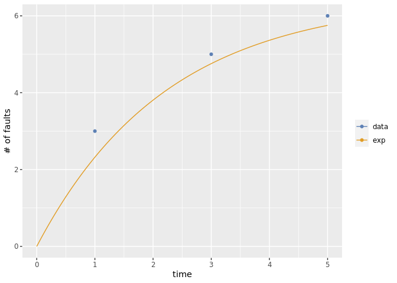<!-- -->

project2

``` r
mvfplot(time=bugs$project2$days, fault=bugs$project2$bugs,
        mvf=list(result$project2$srm))
```

    ## Warning: `mapping` is not used by stat_function()

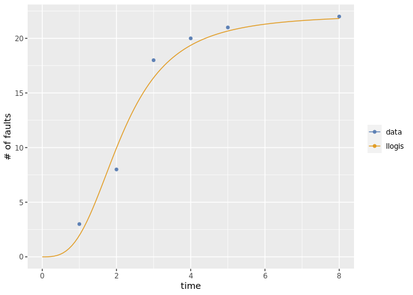<!-- -->

project3

``` r
mvfplot(time=bugs$project3$days, fault=bugs$project3$bugs,
        mvf=list(result$project3$srm))
```

    ## Warning: `mapping` is not used by stat_function()

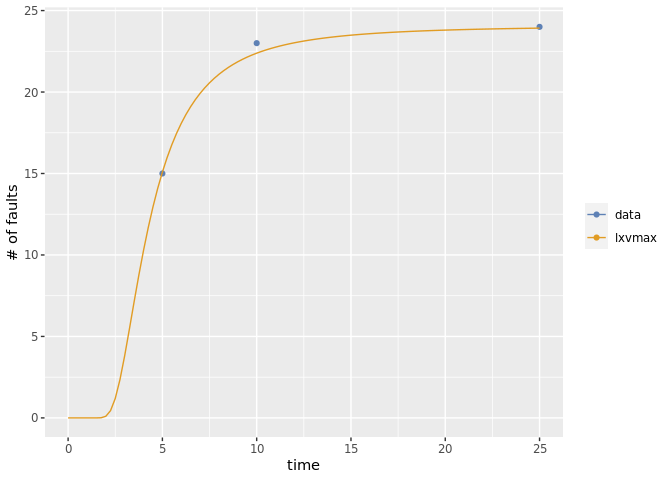<!-- -->

  - モデルを固定する場合は `Rsrat::fit.srm.nhpp(time=dat$days, fault=dat$bugs,
    srm.names="tlogis")` のように `srm.names`
    を指定する．モデル名は`Rsrat::srm.models`にあるものが使える

<!-- end list -->

``` r
Rsrat::srm.models
```

    ##  [1] "exp"    "gamma"  "pareto" "tnorm"  "lnorm"  "tlogis" "llogis" "txvmax"
    ##  [9] "lxvmax" "txvmin" "lxvmin"

### smetricsを使って再推定する（その1）

  - s-metricsデータを使って s-metrics に対する回帰係数と各プロジェクトのモデルのパラメータを再推定する．
  - ここでは`linkfun="log"`（デフォルト）を使う（回帰の方のモデル）

<!-- end list -->

``` r
poiresult <- fit.srm.poireg(formula=~1+KLOC, data=metrics, srms=result)
```

  - グラフのためにモデルのラベルを変更（必ずしも必要な作業ではありません）

<!-- end list -->

``` r
poiresult$srm$srms$project1$name <- paste(poiresult$srm$srms$project1$name, "(poireg)")
poiresult$srm$srms$project2$name <- paste(poiresult$srm$srms$project2$name, "(poireg)")
poiresult$srm$srms$project3$name <- paste(poiresult$srm$srms$project3$name, "(poireg)")
```

推定結果

``` r
poiresult
```

    ##          X.Intercept. KLOC
    ## project1            1   55
    ## project2            1  185
    ## project3            1  235
    ## 
    ## Link function: log
    ## (Intercept)        KLOC 
    ## 1.648716100 0.006934976 
    ## 
    ## project1
    ## Model name: exp (poireg)
    ## [1]  7.6152  0.4047
    ## 
    ## project2
    ## Model name: llogis (poireg)
    ## [1]  18.7592   0.7589   0.3233
    ## 
    ## project3
    ## Model name: lxvmax (poireg)
    ## [1]  26.5342   1.3246   0.3746
    ## Maximum LLF: -28.07473 
    ## AIC: 70.14946 
    ## Convergence: TRUE

project1

``` r
mvfplot(time=bugs$project1$days, fault=bugs$project1$bugs,
        mvf=list(result$project1$srm,poiresult$srm$srms$project1))
```

    ## Warning: `mapping` is not used by stat_function()
    
    ## Warning: `mapping` is not used by stat_function()

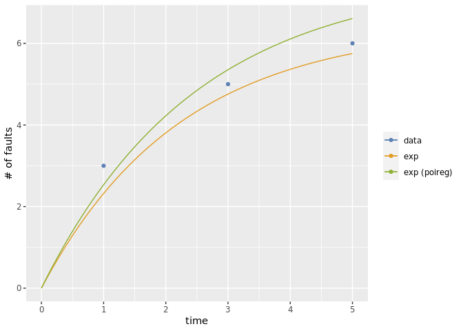<!-- -->

project2

``` r
mvfplot(time=bugs$project2$days, fault=bugs$project2$bugs,
        mvf=list(result$project2$srm,poiresult$srm$srms$project2))
```

    ## Warning: `mapping` is not used by stat_function()
    
    ## Warning: `mapping` is not used by stat_function()

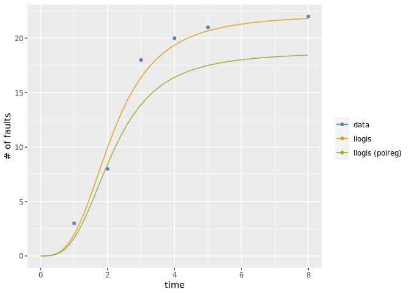<!-- -->

project3

``` r
mvfplot(time=bugs$project3$days, fault=bugs$project3$bugs,
        mvf=list(result$project3$srm,poiresult$srm$srms$project3))
```

    ## Warning: `mapping` is not used by stat_function()
    
    ## Warning: `mapping` is not used by stat_function()

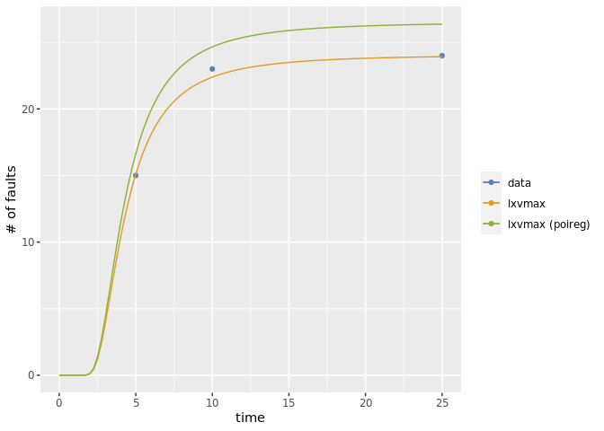<!-- -->

#### 変数選択で効果のある要因だけを残す

``` r
poiresult2 <- step(poiresult) # 変数減少法
```

    ## Start:  AIC=70.15
    ## ~1 + KLOC
    ## 
    ##        Df    AIC
    ## - KLOC  1 69.518
    ## <none>    70.149
    ## 
    ## Step:  AIC=69.52
    ## ~1

  - グラフのためにモデルのラベルを変更（必ずしも必要な作業ではありません）

<!-- end list -->

``` r
poiresult2$srm$srms$project1$name <- paste(poiresult2$srm$srms$project1$name, "(poireg2)")
poiresult2$srm$srms$project2$name <- paste(poiresult2$srm$srms$project2$name, "(poireg2)")
poiresult2$srm$srms$project3$name <- paste(poiresult2$srm$srms$project3$name, "(poireg2)")
```

結果

``` r
poiresult2
```

    ##          X.Intercept.
    ## project1            1
    ## project2            1
    ## project3            1
    ## 
    ## Link function: log
    ## (Intercept) 
    ##     3.13275 
    ## 
    ## project1
    ## Model name: exp (poireg2)
    ## [1]  22.93698   0.05444
    ## 
    ## project2
    ## Model name: llogis (poireg2)
    ## [1]  22.9370   0.7604   0.3259
    ## 
    ## project3
    ## Model name: lxvmax (poireg2)
    ## [1]  22.9370   1.3266   0.3714
    ## Maximum LLF: -28.7591 
    ## AIC: 69.51819 
    ## Convergence: TRUE

project1

``` r
mvfplot(time=bugs$project1$days, fault=bugs$project1$bugs,
        mvf=list(result$project1$srm,poiresult$srm$srms$project1,poiresult2$srm$srms$project1))
```

    ## Warning: `mapping` is not used by stat_function()
    
    ## Warning: `mapping` is not used by stat_function()
    
    ## Warning: `mapping` is not used by stat_function()

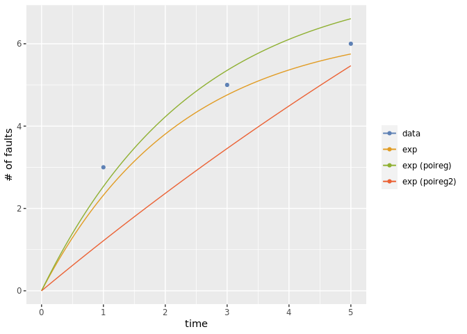<!-- -->

project2

``` r
mvfplot(time=bugs$project2$days, fault=bugs$project2$bugs,
        mvf=list(result$project2$srm,poiresult$srm$srms$project2,poiresult2$srm$srms$project2))
```

    ## Warning: `mapping` is not used by stat_function()
    
    ## Warning: `mapping` is not used by stat_function()
    
    ## Warning: `mapping` is not used by stat_function()

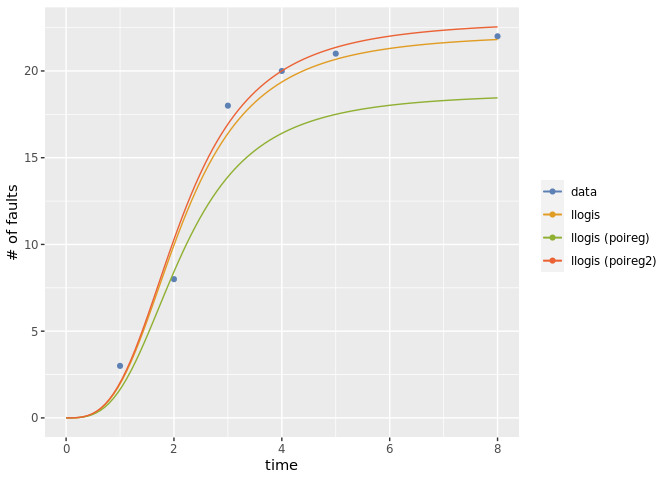<!-- -->

project3

``` r
mvfplot(time=bugs$project3$days, fault=bugs$project3$bugs,
        mvf=list(result$project3$srm,poiresult$srm$srms$project3,poiresult2$srm$srms$project3))
```

    ## Warning: `mapping` is not used by stat_function()
    
    ## Warning: `mapping` is not used by stat_function()
    
    ## Warning: `mapping` is not used by stat_function()

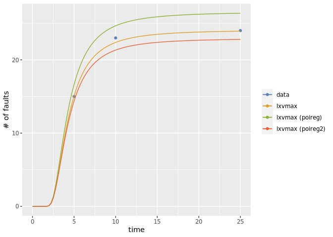<!-- -->

### smetricsを使って再推定する（その2）

  - s-metricsデータを使って s-metrics に対する回帰係数と各プロジェクトのモデルのパラメータを再推定する．
  - ここでは`linkfun="identity"`を使う（回帰の方のモデル）

<!-- end list -->

``` r
poiresult <- fit.srm.poireg(formula=~1+KLOC, data=metrics, srms=result, linkfun="identity")
```

  - グラフのためにモデルのラベルを変更（必ずしも必要な作業ではありません）

<!-- end list -->

``` r
poiresult$srm$srms$project1$name <- paste(poiresult$srm$srms$project1$name, "(poireg)")
poiresult$srm$srms$project2$name <- paste(poiresult$srm$srms$project2$name, "(poireg)")
poiresult$srm$srms$project3$name <- paste(poiresult$srm$srms$project3$name, "(poireg)")
```

推定結果

``` r
poiresult
```

    ##          X.Intercept. KLOC
    ## project1            1   55
    ## project2            1  185
    ## project3            1  235
    ## 
    ## Link function: identity
    ## (Intercept)        KLOC 
    ##   0.8047194   0.1059062 
    ## 
    ## project1
    ## Model name: exp (poireg)
    ## [1]  6.6296  0.4413
    ## 
    ## project2
    ## Model name: llogis (poireg)
    ## [1]  20.3974   0.7595   0.3243
    ## 
    ## project3
    ## Model name: lxvmax (poireg)
    ## [1]  25.6927   1.3251   0.3738
    ## Maximum LLF: -27.71532 
    ## AIC: 69.43065 
    ## Convergence: TRUE

project1

``` r
mvfplot(time=bugs$project1$days, fault=bugs$project1$bugs,
        mvf=list(result$project1$srm,poiresult$srm$srms$project1))
```

    ## Warning: `mapping` is not used by stat_function()
    
    ## Warning: `mapping` is not used by stat_function()

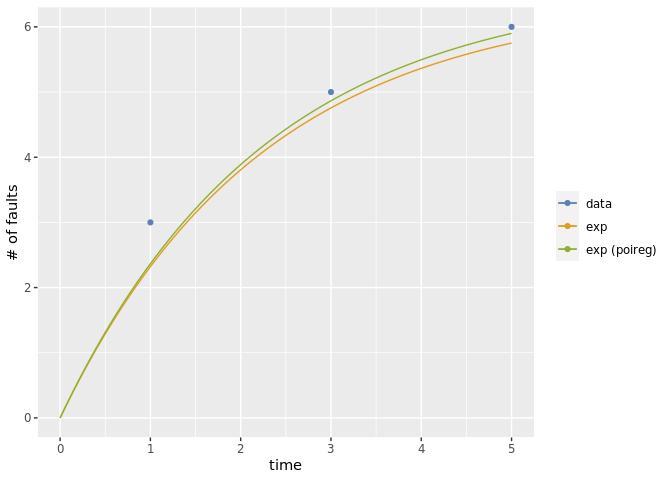<!-- -->

project2

``` r
mvfplot(time=bugs$project2$days, fault=bugs$project2$bugs,
        mvf=list(result$project2$srm,poiresult$srm$srms$project2))
```

    ## Warning: `mapping` is not used by stat_function()
    
    ## Warning: `mapping` is not used by stat_function()

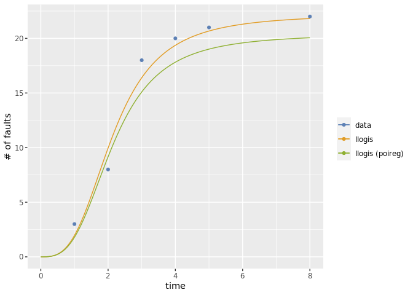<!-- -->

project3

``` r
mvfplot(time=bugs$project3$days, fault=bugs$project3$bugs,
        mvf=list(result$project3$srm,poiresult$srm$srms$project3))
```

    ## Warning: `mapping` is not used by stat_function()
    
    ## Warning: `mapping` is not used by stat_function()

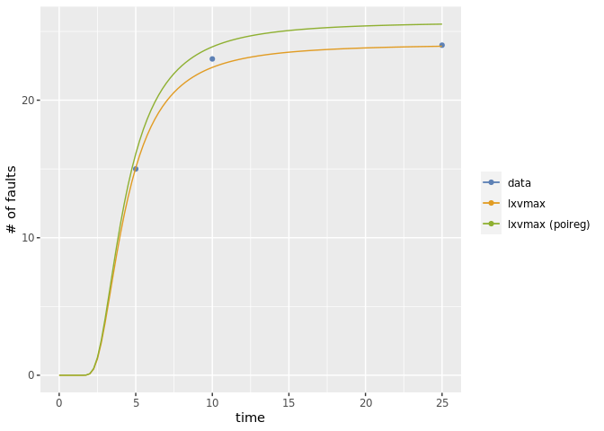<!-- -->

#### 変数選択で効果のある要因だけを残す

``` r
poiresult2 <- step(poiresult) # 変数減少法
```

    ## Start:  AIC=69.43
    ## ~1 + KLOC
    ## 
    ##        Df    AIC
    ## <none>    69.431
    ## - KLOC  1 69.518

  - グラフのためにモデルのラベルを変更（必ずしも必要な作業ではありません）

<!-- end list -->

``` r
poiresult2$srm$srms$project1$name <- paste(poiresult2$srm$srms$project1$name, "(poireg2)")
poiresult2$srm$srms$project2$name <- paste(poiresult2$srm$srms$project2$name, "(poireg2)")
poiresult2$srm$srms$project3$name <- paste(poiresult2$srm$srms$project3$name, "(poireg2)")
```

結果

``` r
poiresult2
```

    ##          X.Intercept. KLOC
    ## project1            1   55
    ## project2            1  185
    ## project3            1  235
    ## 
    ## Link function: identity
    ## (Intercept)        KLOC 
    ##   0.8047194   0.1059062 
    ## 
    ## project1
    ## Model name: exp (poireg) (poireg2)
    ## [1]  6.6296  0.4413
    ## 
    ## project2
    ## Model name: llogis (poireg) (poireg2)
    ## [1]  20.3974   0.7595   0.3243
    ## 
    ## project3
    ## Model name: lxvmax (poireg) (poireg2)
    ## [1]  25.6927   1.3251   0.3738
    ## Maximum LLF: -27.71532 
    ## AIC: 69.43065 
    ## Convergence: TRUE

project1

``` r
mvfplot(time=bugs$project1$days, fault=bugs$project1$bugs,
        mvf=list(result$project1$srm,poiresult$srm$srms$project1,poiresult2$srm$srms$project1))
```

    ## Warning: `mapping` is not used by stat_function()
    
    ## Warning: `mapping` is not used by stat_function()
    
    ## Warning: `mapping` is not used by stat_function()

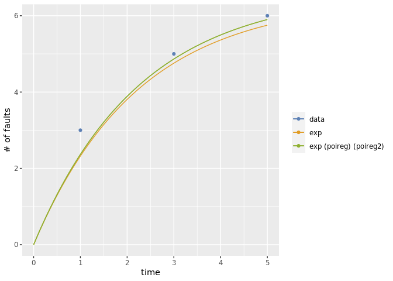<!-- -->

project2

``` r
mvfplot(time=bugs$project2$days, fault=bugs$project2$bugs,
        mvf=list(result$project2$srm,poiresult$srm$srms$project2,poiresult2$srm$srms$project2))
```

    ## Warning: `mapping` is not used by stat_function()
    
    ## Warning: `mapping` is not used by stat_function()
    
    ## Warning: `mapping` is not used by stat_function()

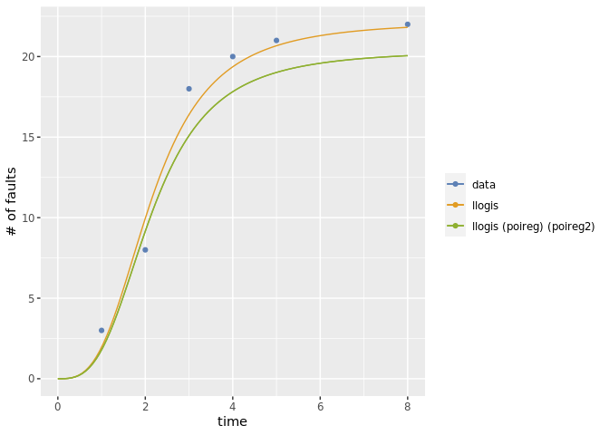<!-- -->

project3

``` r
mvfplot(time=bugs$project3$days, fault=bugs$project3$bugs,
        mvf=list(result$project3$srm,poiresult$srm$srms$project3,poiresult2$srm$srms$project3))
```

    ## Warning: `mapping` is not used by stat_function()
    
    ## Warning: `mapping` is not used by stat_function()
    
    ## Warning: `mapping` is not used by stat_function()

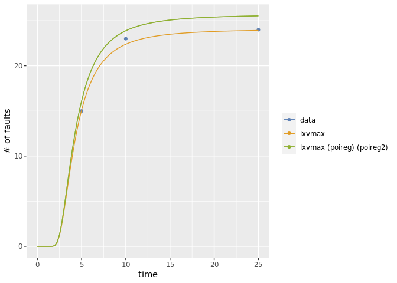<!-- -->
